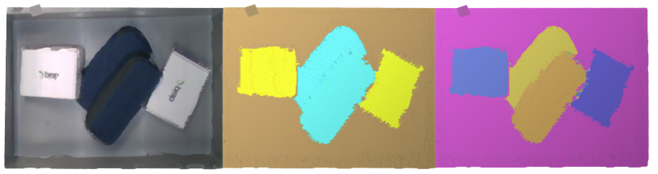
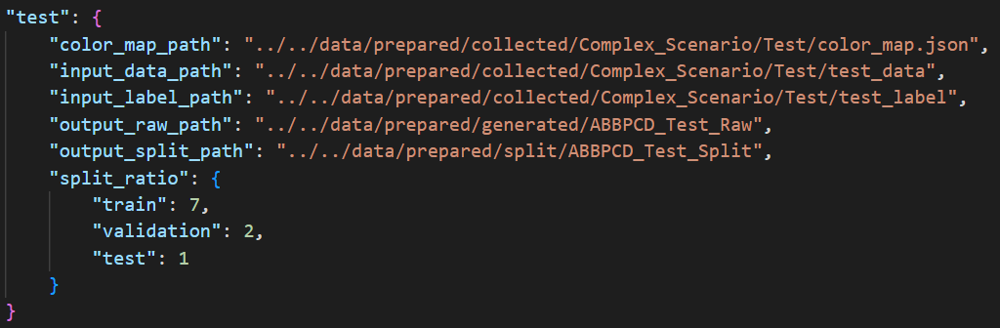
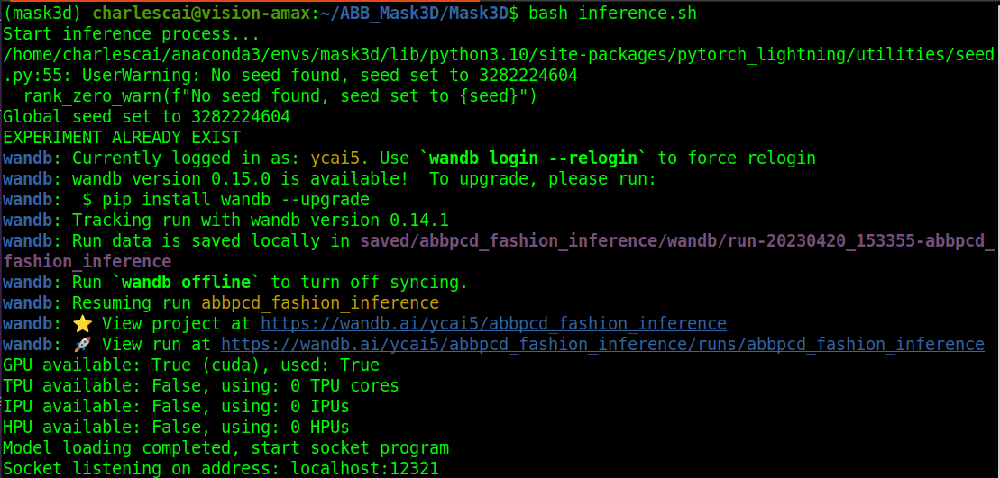
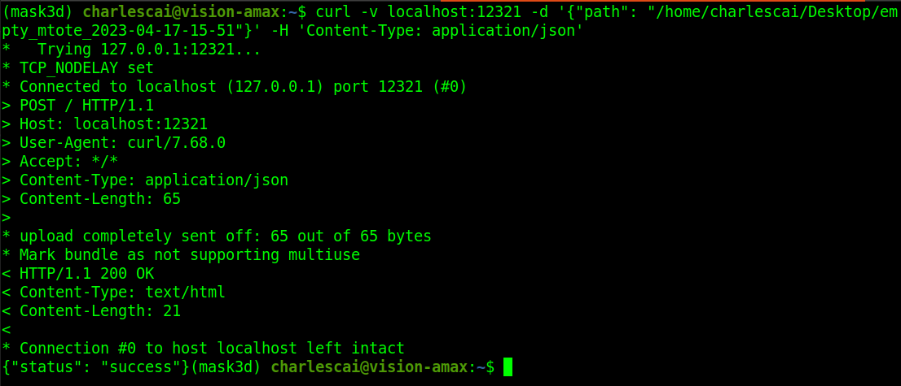
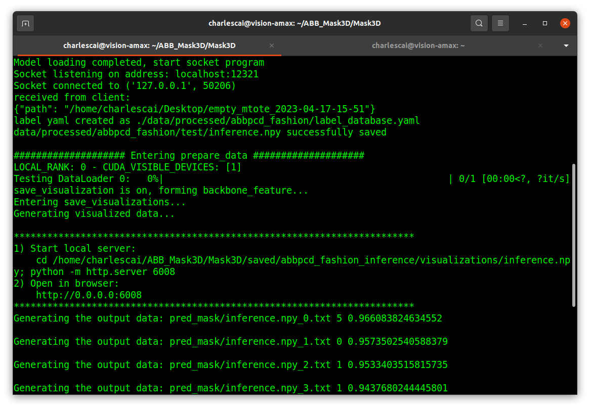

## ABB_Mask3D Getting Started ##

As the first transform-based DL model, Mask3D predicts accurate 3D semantic instances achieving state-of-the-art on ScanNet, ScanNet200, S3DIS and STPLS3D.

<a href="https://pytorch.org/get-started/locally/"></a>
<a href="https://pytorchlightning.ai/"></a>
<a href="https://hydra.cc/"></a>
<a href="https://developer.nvidia.com/cuda-toolkit"></a>
<a href="https://nvidia.github.io/MinkowskiEngine/"></a>

---

## Table of Content

* [Introduction](#introduction)
* [Code Structure](#code-structure)
* [Environment Setup](#setup)
  * [x86_64 platform](#x86_64)
  * [aarch64 platform](#aarch64)
* [Model Runtime](#model-runtime)
  * [Data Processing](#data-processing)
    * [Data Preparation](#data-preparation)
    * [Preprocessing](#preprocessing)
  * [Training and Testing](#training-and-testing)
  * [Inference](#inference)
* [Trouble Shootings](#trouble-shootings)
* [Maintainer](#maintainer)

## Introduction
---
Depth information plays significant roles on recognizing objects under bin-picking scenarios. [Mask3D Neural Network](https://arxiv.org/abs/2210.03105) exhibits a promising prospect for improving current picking approach by segmenting items with a descent accuracy. 




## Code Structure
---
This is the version adapted from the codebase of [Mask3D](https://github.com/JonasSchult/Mask3D), but more modules have been added to process the raw image data collected from ABB pick-and-place lab group. The functionality of each module is listed:

```
├── benchmark
│   ├── evaluate_semantic_instance.py <- evaluation
|   ├── util_3d.py                    
│   └── util.py                       
├── conf                              <- configurations
│   ├── [config_folders]
|   ├── ...
|   └── base_config.yaml
├── data                              <- data for training 
│   ├── prepared                      <- configurations
│       ├── collected                 <- collected raw RGB and Depth
│       ├── generated                 <- generated raw pcd
│       └── split                     <- split pcd
│   ├── processed                     <- preprocessed pcd datasets
│   └── raw                           <- split pcd datasets
├── dataset
│   ├── configuration
│       ├── dataset_yaml              <- pcd yaml files
│           ├── abbpcd_box.yaml
│           ├── abbpcd_test.yaml
│           └── ...
│       ├── templates                 <- template for config
│       └── conf_gen.py               <- script to generate config files
│   ├── preparation
│       ├── datasets.json             <- json file for datasets
│       ├── data_gen_split.py         <- entrance for making pcd
│       ├── pcd_generator.py          <- raw point cloud generator
│       ├── pcd_splitter.py           <- splitting point cloud data
│       └── variables.py              <- variables for dataset
│   ├── preprocessing
│       ├── abbpcd_preprocessing.py
│       └── base_preprocessing.py
│   ├── random_cuboid.py
│   ├── semseg.py                     <- generate prediction mask
│   └── utils.py
├── docs
├── inference                         <- inference script
├── models                            <- Mask3D modules
├── saved                             <- folder storing models and logs
├── scripts                           <- train scripts
├── thrid_party
├── trainer                           <- train loop
│   ├── __init__.py                   
│   └── trainer.py     
├── inference.sh                      <- run inference on socket       
├── main.py                           <- main entrance
├── README.md
└── requirements.txt                           
```


## Setup
___

Two architecture/platforms are supported: [x86_64](#x86_64) / [aarch64](#aarch64), and main modules to be installed are as following:

* `Nvidia CUDA Library`
* `Conda Virtual Environment`
* `PyTorch/PyTorch-Lightning`
* `Nvidia MinkowskiEngine`
* `Other Dependencies`
* `Third Party`  

### **<span style="color: lightblue" id="x86_64">x86_64</span>**

---
The main dependencies on *x86_64* are:
```yaml
python: 3.10.6
cuda: 11.6
```

You can set up a conda environment following below steps： 

- **Nvidia CUDA library** `(CUDA 11.6)`

Just follow the [procedure](https://developer.nvidia.com/cuda-toolkit-archive) on Nvidia website to install CUDA library of correct version from source 

- **Create virtual environment with Anaconda** `(Python 3.10.6)`

Use the [link](https://docs.anaconda.com/anaconda/install/linux/) to install *Anaconda* under linux and create virtual environment

```bash
$ conda create --name=mask3d python=3.10.6
$ conda activate mask3d

$ conda update -n base -c defaults conda
$ conda install openblas-devel -c anaconda
```

- **PyTorch and related packages**

Install preliminary dependencies by PyTorch

```bash
# Install required packages by Pytorch
$ sudo apt-get -y update; 
$ sudo apt-get -y install autoconf bc build-essential g++-8 gcc-8 clang-8 lld-8 gettext-base gfortran-8 iputils-ping libbz2-dev libc++-dev libcgal-dev libffi-dev libfreetype6-dev libhdf5-dev libjpeg-dev liblzma-dev libncurses5-dev libncursesw5-dev libpng-dev libreadline-dev libssl-dev libsqlite3-dev libxml2-dev libxslt-dev locales moreutils openssl python-openssl rsync scons python3-pip libopenblas-dev
```

Install torch, torchvision, torch_scatter and lightning:
```bash
# Install torch
$ pip install torch --extra-index-url https://download.pytorch.org/whl/cu116/torch-1.12.1%2Bcu116-cp310-cp310-linux_x86_64.whl

# Install torchvision
$ pip install torchvision --extra-index-url https://download.pytorch.org/whl/cu116/torchvision-0.13.1%2Bcu116-cp310-cp310-linux_x86_64.whl

# Install torch_scatter and lightning
$ pip install torch_scatter==2.0.9 pytorch-lightning==1.7.2
```

- **Nvidia MinkowskiEngine**

MinkowskiEngine is a deep learning library which could efficiently handle large-scale 3D and 4D data with high spatial resolution (point cloud data)

```bash
# Install from source
$ git clone https://github.com/NVIDIA/MinkowskiEngine.git

# Use multi-thread to avoid memory cache issue
$ export MAX_JOBS=4 
$ cd MinkowskiEngine && python3 setup.py install
```

- **Other Dependencies**

```bash
$ pip install ninja==1.10.2.3 fire imageio tqdm wandb scipy matplotlib
$ pip install python-dotenv pyviz3d plyfile scikit-learn trimesh loguru   
$ pip install fvcore pycocotools cloudpickle volumentations
$ pip install antlr4-python3-runtime==4.8 albumentations
$ pip install black==21.4b2 torch-scatter==2.0.9
$ pip install omegaconf==2.0.6 hydra-core==1.0.5
$ pip install 'git+https://github.com/facebookresearch/detectron2.git@710e7795d0eeadf9def0e7ef957eea13532e34cf' --no-deps
```

- **Third party**
```bash
cd third_party/pointnet2 && python setup.py install
```

> Finally, you can check your environment by referencing [requirements-x86_64.txt](./requirements-x86_64.txt) 

### **<span style="color: lightblue" id="aarch64">aarch64</span>**

---

Required packages are the same as on [x86_64](#x86_64), but several steps may be different. The main tested dependencies under *aarch64* are:
```yaml
python: 3.8.10
cuda: 11.4
```

Install PyTorch with different version `(v1.11.0)`

```bash
# Install Pytorch wheel package (v1.11.0) from Nvidia website	  

$ export TORCH_INSTALL=https://nvidia.box.com/shared/static/ ssf2v7pf5i245fk4i0q926hy4imzs2ph.whl
$ python3 -m pip install --upgrade pip; python3 -m pip install aiohttp numpy=='1.19.4' scipy=='1.5.3' 
$ export "LD_LIBRARY_PATH=/usr/lib/llvm-8/lib:$LD_LIBRARY_PATH"; 
$ python3 -m pip install --upgrade protobuf
$ python3 -m pip install --no-cache $TORCH_INSTALL
```

Install PyTorch-Vision and PyTorch-Lightning from source
```bash
# Install torchvision
$ git clone https://github.com/pytorch/vision.git
$ cd vision && python3 setup.py install

# Install lightning
$ git clone https://github.com/Lightning-AI/lightning.git
$ cd lightning && git checkout 1.7.2 && python3 setup.py install
```

> Finally, you can check your environment by referencing [requirements-aarch64.txt](./requirements-aarch64.txt)

## Model Runtime
---

Runtime includes several parts ranging from data preparation, data preprocessing to training, testing and inference for single object :

### Data Processing
---

- #### **Data Preparation**

Data Preparation phase is to generate 3D point cloud data with good quality from 2D images (RGB + Depth) which contain **original data**, **labeled data** and **color_map.json** :

Edit yaml file in `dataset/configuration/dataset_yaml` for your dataset : (e.g.)
```yaml
# name
dataset_name: abbpcd_test

# label
class_map:
  dustpan: 0
  envelope: 1
  bin: 2

# color prediction
color_map:
  0:        # (Red)
    - 237
    - 28
    - 36
  1:        # (Green)
    - 34
    - 177
    - 76
  2:        # (Yellow)
    - 255 
    - 242
    - 0      
```

Generate config file using yaml and template for your dataset :

```bash
$ cd dataset/configuration && python conf_gen.py --dataset_yaml_path="configuration/dataset_yaml/abbpcd_test.yaml" && cd -
```

> After that, a new file should be generated as `data/datasets/abbpcd_test.yaml`

Then add information about new dataset and camera in `dataset/preparation/datasets.json` :



Modify `"dataset_name"` as `"test"` in `dataset/preparation/variables.py` and run `data_gen_split.py` to generate raw point cloud data and split into train/test/validation set :
```bash
$ cd dataset/preparation && python data_gen_split.py && cd -
```
> After serveral minutes around, a folder `ABBPCD_Test_Split` containing split raw point cloud data would be generated under path `data/prepared/split`

---

- #### **Preprocessing**
Move or copy the split data folder into path `data/raw`
```bash
$ mv data/prepared/split/ABBPCD_Test_Split data/raw/abbpcd_test
```
Run the script for preprocessing the raw data
```bash
$ python dataset/preprcessing/abbpcd_preprocessing.py preprocess --data_dir="./data/raw/abbpcd_test" --save_dir="./data/processed/abbpcd_test" --dataset_yaml="./dataset/configuration/dataset_yaml/abbpcd_test.yaml"
```
> A new folder `abbpcd_test` would be generated under `data/processed/` for training


## Training and Testing
---
Indicate some necessary parameters in `scripts/abbpcd/abppcd_test.sh` like **batch_size**, **num_labels**, **datasets**, **backbone**, **voxel_size**, etc. and run script 
```bash
$ bash scripts/abbpcd/abbpcd_test.sh
```

## Inference
---
The inference process is set up using the socket program. In `inference.sh`, you have to state **ip** and **port** for running script on socket. Also, **checkpoint path**, and information regarding **training dataset** should be indicated. After that, run script
```bash
$ bash inference.sh
``` 
The model will be loaded into memory and socket keeps listening for request



For inference on single image, add absolute path of generated raw folder and encapsulate it into HTTP request. the sender will get response 



After that, you can check inference result accordingly


## Trouble Shootings
---
- Some issues regarding `python module import` may happen when you run the script, just check the path and whether the package has been installed correspondently
- This model doesn't support Multi-GPU, so remember to check your CUDA variable -- `CUDA_VISIBLE_DEVICES` every time before you start any training or testing process

## Maintainer
- Yihao Cai (yihao.cai@us.abb.com)
